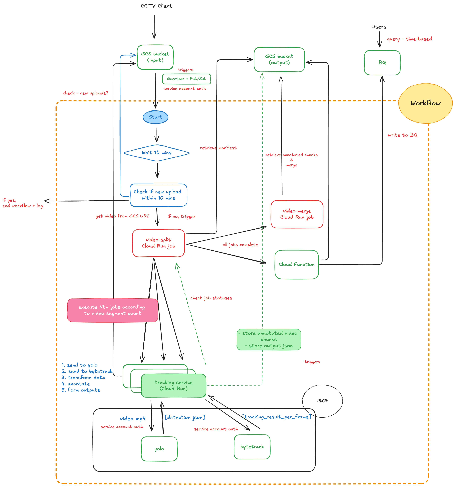

## Solution



### Additional modified scripts needed
- Marked as new and modified below:

```
cv-processing-gcp
├── README.md
├── gcp-terraform
│   ├── app
│   │   ├── bigquery
│   │   │   ├── main.py
│   │   │   └── requirements.txt
│   │   ├── tracking-job
│   │   │   ├── Dockerfile
│   │   │   ├── main.py
│   │   │   └── requirements.txt
│   │   ├── video-merge
│   │   │   ├── Dockerfile
│   │   │   ├── requirements.txt
│   │   │   └── video-merge.py
│   │   ├── video-split
│   │   │   ├── Dockerfile
│   │   │   ├── requirements.txt
│   │   │   └── video-split.py
│   │   └── yolo
│   │       ├── Dockerfile
│   │       ├── datature-yolov8n.pt
│   │       ├── requirements.txt
│   │       └── yolov8_service.py
│   ├── iam.tf
│   ├── kubernetes.tf
│   ├── main.tf
│   ├── outputs.tf
│   ├── provider.tf
│   ├── serverless.tf
│   ├── triggers.tf
│   ├── variables.tf
│   └── workflow.yaml
└── yolo-bytetrack-parallel-processing.png
```

### Part 1 - Video Segmentation:

- Add a function to first break down video into each frame and divide them into smaller chunks (each chunk will be a sequence of frames)
- Currently, with the unique request_id, breaking it down into batch for example: request_id_chunk_001, request_id_chunk_002, etc.
- Per request, store metadata (e.g. request ID, total number of chunks, list of chunk IDs with subsequent corresponding frame Id ranges and timestamps + results data)

Example manifest.json
```
{
  "segment_count": 4,
  "segments": [
    {
      "request_id": "req_CJ3vm4CD_20240915T033820",
      "segment_file": "output0000.mp4",
      "segment_number": 0,
      "start_time": "",
      "duration": "3",
      "original_video": "sample.mp4"
    },
    {
      "request_id": "req_CJ3vm4CD_20240915T033820",
      "segment_file": "output0001.mp4",
      "segment_number": 1,
      "start_time": "3",
      "duration": "3",
      "original_video": "sample.mp4"
    },
    {
      "request_id": "req_CJ3vm4CD_20240915T033820",
      "segment_file": "output0002.mp4",
      "segment_number": 2,
      "start_time": "33",
      "duration": "3",
      "original_video": "sample.mp4"
    },
    {
      "request_id": "req_CJ3vm4CD_20240915T033820",
      "segment_file": "output0003.mp4",
      "segment_number": 3,
      "start_time": "333",
      "duration": "3",
      "original_video": "sample.mp4"
    }
  ]
}
```

### Part 2 - Parallel Processing:

- Create Cloud Run jobs to process the chunks in parallel. (Use Cloud Workflow to manage cloud run jobs as part of workflow. Configure auto scaling to scale basedo n load.

### Part 3 - Ordering and Combining back results
- When all jobs are done > trigger an 'video merge job' that runs to retrieve each chunk's result, based on the ordering/IDs, writing back the annotated frames and get the final video.
- Cloud Storage bucket will store the manifest, split_chunks/, processed_chunks/ (annotated chunks), and final merged video.

- Example of each request's folder:


### Steps/instructions
1. Build images
- Build and push for all `video-split`, `video-merge`, `tracking-job` repo (note about repo image name format:latest)

e.g. video-split
```
cd cv-processing-gcp/gcp-terraform/app/video-split
docker build -t splitting:v5 .
docker tag splitting:v5 asia-southeast1-docker.pkg.dev/{project_id}/video-split-job/video-split-job-image:latest
docker push asia-southeast1-docker.pkg.dev/{project_id}/video-split-job/video-split-job-image:latest
```

2. `terraform init` , `terraform plan`, `terraform apply`
3. upload a sample video to upload bucket
4. workflow will be executed

### Things to consider
- Scalability and performance - implement auto scaling for Cloud Run jobs and GKE clusters based on workload. Use Cloud Monitoring to trigger scaling events based on custom metrics.
- Even distribution of tasks/jobs with load balancing, also for incoming requests
- Error Handling and Recovery - Add to catch and log exceptions (try-catch) at each stage of the parallel processing pipeline. Implement logging to not only for troubleshooting, also to understand bottleneck of pipeline through tracing.
- Design a retry mechanism for failed tasks, at the same time use exponential backoff to avoid clogging up the pipeline.
- Data integrity - calculate and store checksums for each video chunk in the metadata stored, verify with those post-processing.
- Edge case: consider potential lost of context at boundaries of video chunks or dropped frames.
- Solution in previous tasks, should consider with a CI/CD pipelines to automatically test and deploy changes. Also capture the latest pushed images that has been tested and deploy to production, with automatic roll back.